# helical-pdqueiros

# Task description

Objective: Build a containerized workflow orchestration environment that launches and monitors Helical model executions using Dockerized Airflow.

The goal is to demonstrate your understanding of:

- Containerized environments and orchestration tools (Docker, Airflow)
- Scalable practices for large models and large datasets in computational biology

We’re not expecting a production-grade system — we care most about your approach, simplicity, and reasoning.

Requirements
1. Airflow Environment
    - Set up Apache Airflow in a Dockerized environment (you can use docker compose or your own setup and get started here).
    - Configure Airflow to run locally with a simple DAG that:
      1. Starts a Helical container (you can use the Helical Package)
      2. Mounts a local folder containing data (e.g., sample .h5ad files or any dataset of your choice).
      3. Executes a Helical model (e.g., one of the examples like Cell Type Annotation or Fine-Tuning).

The Airflow DAG should be visible and runnable from the Airflow web UI.


2. Containerization
    - Create a Dockerfile for the Helical environment:
      - The container should have Python, the Helical package, and any necessary dependencies installed.
      - Ensure that the container can execute a simple Helical command or script when started (e.g., a workflow that prints model metadata or runs a small inference task).
      - Ensure that the data folder is mounted correctly into the container during execution.


3. Scaling
To handle larger models and datasets efficiently, consider:
    - Memory: Stream or memory-map large .h5ad data instead of loading fully into RAM.
    - Batching strategy: Implement batched loading so models process data in smaller chunks.
    - Resource profiles: Define model-specific needs (GPU type, precision, memory cap) for smarter scheduling.
    - Precision: Use FP16/mixed precision or offloading to cut GPU memory usage.

4. Monitoring & Metrics
    - Add Prometheus and Grafana to your setup (can be via docker compose or separate containers).
    - Expose and visualize basic metrics such as:
      - Airflow task success/failure counts
      - Container resource usage (CPU/memory)
      - Workflow duration


## Workflow template

I'm using this example from Helical-AI as [template](./helical/examples/run_models/run_geneformer.py) for the general workflow of this repo.


# Setup

### Base requirements

You need to have these installed on your machine:
- Install [Docker Desktop](https://www.docker.com/get-started/) if running this repo on WSL
- Install GPU drivers, I have an Nvidia GPU so I've installed their respective drivers.


### GPU setup

I assume you have a system with a GPU, if not I would avoid running the fine-tuning step describe below.


If you are using WSL via a Windows sytem with a GPU install [Docker desktop](https://docs.docker.com/desktop/features/gpu/) for a straightforward way to enable GPU support on your docker engine.
You can test if your GPU(s) are available by running this:
```bash
docker run --rm -it --gpus=all nvcr.io/nvidia/k8s/cuda-sample:nbody nbody -gpu -benchmark
```
You should see something like this:
```bash
> Compute 8.6 CUDA device: [NVIDIA GeForce RTX 3080]
69632 bodies, total time for 10 iterations: 54.144 ms
= 895.504 billion interactions per second
= 17910.074 single-precision GFLOP/s at 20 flops per interaction
```

You can also run this to check GPU access:
```bash
docker run --rm --gpus all nvidia/cuda:12.1.1-base-ubuntu22.04 nvidia-smi
```


## Docker deployment

Below you will find the instructions to setup all the necessary requirements to run Airflow and respective DAGs required for fine-tuning a Geneformer for cell type annotation.

**Note that I've included a `.env` file which contains all the necessary environmental variables for setting up your containers**

**Make sure you start Docker Desktop so that you have GPU access.**

To test if your machine's GPUs are available run:
```bash
docker run --rm --gpus all nvidia/cuda:12.1.1-base-ubuntu22.04 nvidia-smi
```


To deploy all the necessary containers run:
```bash
# we are using a custom Airflow image since we need open telemetry and docker operators
docker compose -f docker-compose-build.yaml build helical-pdqueiros-airflow
docker compose -f docker-compose-storage.yaml up -d
docker compose -f docker-compose-monitoring.yaml up -d
docker compose -f docker-compose-airflow.yaml up -d
```

This will deploy all basic services with docker, including:
- minio for S3 simulation and Mlflow storage
- postgres for Mlflow and Airflow. Note that I used the base docker compose file from [Airflow](https://airflow.apache.org/docs/apache-airflow/stable/howto/docker-compose/index.html); you could also deploy Airflow via [Terraform](https://github.com/airflow-helm/charts). To avoid exposing the host's docker.sock I'm also deploying a proxy (docker-socket-proxy) as explained [here](https://github.com/benjcabalona1029/DockerOperator-Airflow-Container/tree/master) and [here](https://medium.com/@benjcabalonajr_56579/using-docker-operator-on-airflow-running-inside-a-docker-container-7df5286daaa5).
- Prometheus, Pushgateway, Cadvisor, Redis, Grafana, node-exporter, and otel-collector for monitoring. Otel-collector is used for Airflow monitoring, whereas the others are used for system and containers monitoring.

Make sure you have all these containers:
```bash
IMAGE                                              NAMES                                       STATUS
helical-pdqueiros-airflow:latest                   helical_pdqueiros-airflow-worker-1          Up 4 minutes (healthy)
helical-pdqueiros-airflow:latest                   helical_pdqueiros-airflow-apiserver-1       Up 4 minutes (healthy)
helical-pdqueiros-airflow:latest                   helical_pdqueiros-airflow-dag-processor-1   Up 4 minutes (healthy)
helical-pdqueiros-airflow:latest                   helical_pdqueiros-airflow-triggerer-1       Up 4 minutes (healthy)
helical-pdqueiros-airflow:latest                   helical_pdqueiros-airflow-scheduler-1       Up 4 minutes (healthy)
postgres:16                                        postgres-airflow                            Up 5 minutes (healthy)
redis:7.2-bookworm                                 redis-airflow                               Up 5 minutes (healthy)
tecnativa/docker-socket-proxy:v0.4.1               airflow-docker-socket                       Up 5 minutes
grafana/grafana-oss                                monitoring-grafana                          Up 5 minutes
prom/prometheus:latest                             monitoring-prometheus                       Up 5 minutes
gcr.io/cadvisor/cadvisor:latest                    monitoring-cadvisor                         Up 5 minutes (healthy)
otel/opentelemetry-collector-contrib               monitoring-otel-collector                   Up 5 minutes
quay.io/prometheus/node-exporter:latest            monitoring-node-exporter                    Up 5 minutes
prom/pushgateway                                   monitoring-pushgateway                      Up 5 minutes
redis:latest                                       redis-monitoring                            Up 5 minutes
ghcr.io/mlflow/mlflow:latest                       storage-mlflow-server                       Up 5 minutes (healthy)
postgres:16.4-bullseye                             postgres-mlflow                             Up 5 minutes (healthy)
quay.io/minio/minio:RELEASE.2025-01-20T14-49-07Z   storage-minio                               Up 5 minutes (healthy)
```

The main tools here (i.e., that you actually might interact with) are : Airflow, Grafana, Mlflow, and Minio. All others are containers that are "supporting" these tools.

Now that you are done deploying the services, you can now build the images for the containers that will be deployed by Airflow via Docker operators. There's 2 versions here, `helical-pdqueiros-cpu` is a small image that contains some CPU-only requirements, whereas `helical-pdqueiros-gpu` contains all the requirements for running the actual fine-tuning. You likely could further trim the GPU image but for the sake of keeping it simpler, I've used Helical-AI's Dockerfile as a template.

```bash
docker compose -f docker-compose-build.yaml build helical-pdqueiros-cpu
docker compose -f docker-compose-build.yaml build helical-pdqueiros-gpu
```

This image contains all my source code as well as Helical's package (among a few other dependencies).

You should end up with these images:
```bash
REPOSITORY                             TAG                            IMAGE ID       CREATED          SIZE
helical-pdqueiros-cpu                  latest                         2a6c2dd3244a   6 minutes ago    3.87GB
helical-pdqueiros-gpu                  latest                         b064f44875c6   37 minutes ago   20.8GB
helical-pdqueiros-airflow              latest                         bb0a6e2e764c   56 minutes ago   2.92GB
```
Notice how helical-pdqueiros-cpu and helical-pdqueiros-gpu have such different sizes, and would therefore be faster to build, pull, and deploy allowing for faster development iterations.
(*I would further split the helical package into groups*)

Assuming everything was deployed correctly, you should now have access to all the necessary services and you can check their respective dashboards at:

- [Minio](http://localhost:9001) (credentials: minio/minio123)
- [Mlflow](http://localhost:5000)
- [Grafana](http://localhost:3000/login) (credentials: admin/admin)
- [Airflow](http://localhost:8080/) (credentials: airflow/airflow)
- [Prometheus](http://localhost:9090/)


When you access the [Minio](http://localhost:9001) dashboard, you should see 2 buckets: `helical` and `mlflow`; the `helical` bucket is where you will load your test data, which I've included in `tests/test_data.h5ad`.

In [Airflow](http://localhost:8080/) you will see these DAGs:

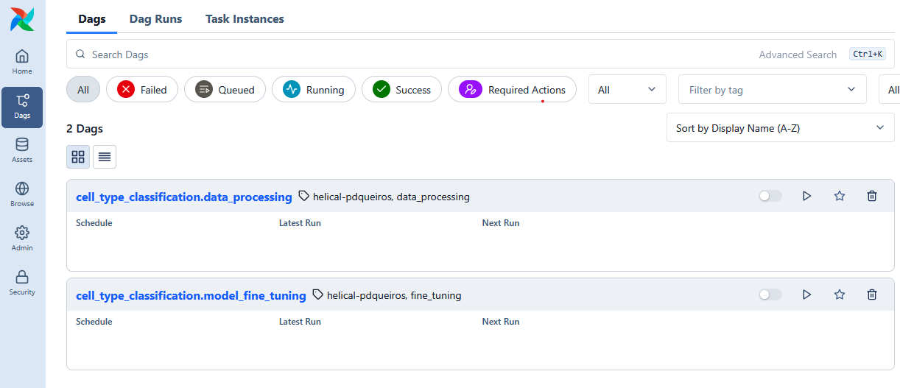


If you open [Grafana](http://localhost:3000/login) you will have multiple dashboards, `Helical dashboard` among them, which is where you can track system resources and Airflow runs.

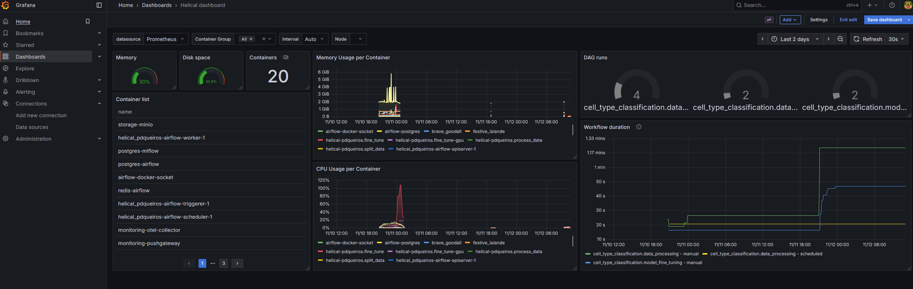


# Workflow


As per Helical-AI's example [notebook](https://github.com/helicalAI/helical/blob/release/examples/notebooks/Cell-Type-Annotation.ipynb) I've used this [dataset](https://huggingface.co/datasets/helical-ai/yolksac_human) for the Geneformer fine-tuning.

## General workflow

I've designed this pipeline in 4 major steps:

1. User or an automated process uploads training data to a staging area (for example to an S3 bucket).
2. When new data arrives, a Dag is triggered (as a POC I didn't include a schedule interval) which [splits](#data-splitting) the raw data into chunks.
3. These [chunks are processed](#data-processing) across multiple containers (if you set it up in that manner using K8s or Ray).
4. A model is [fine-tuned](#model-fine-tuning) and the respective experiment is logged into Mlflow. Note that this last step should be triggered manually or with a large enough schedule interval as model training is quite expensive and something you want to monitor.


Below you can find the underlying logic for each step (3-5). These were first created as Jobs for development and then deployed as Airflow Docker operators.

### Data splitting


```python

class SplitDataJob():
    def _run(self):
        downloaded_files : list[str] = self.task.download_data_to_split()
        if not downloaded_files:
            return
        chunked_files : list[str] = self.task.split_data()
        uploaded_files : list[str] = self.task.upload_chunked_files(list_files=chunked_files)
        archived_files: list[str] = self.task.archive_raw_data(list_files=downloaded_files)

```

### Data processing

```python
class ProcessDataJob():
    def run(self):
        downloaded_files : list[str] = self.task.download_data_to_process()
        if not downloaded_files:
            return
        processed_files: list[str] = self.task.process_data()
        deleted_files: list[str] = self.task.delete_chunked_files(list_files=downloaded_files)
        uploaded_files: list[str] = self.task.upload_processed_files(list_files=processed_files)
```

### Model fine-tuning

```python
class FineTuneJob():
    def _run(self):
        downloaded_files : list[str] = self.task.download_data_to_fine_tune()
        if not downloaded_files:
            return
        uncompressed_files: list[str] = self.task.uncompress_data(list_files=downloaded_files)
        fine_tuning_files: list[str] = self.task.fine_tune(list_files=uncompressed_files)
        archived_files: list[str] = self.task.archive_processed_data()
```


**Below I've described how you can run these pipelines locally, and I also went through the underlying logic of each step, so even if you don't intend to do local testing, you ought to go through the following section anyhow.**


## Detailed workflow description and local testing

You can test your DAGs locally without Airflow by running each job outside of Airflow, since in essence Airflow is merely providing scheduling and observability and all the business logic is within the `src` code.
Keep in mind that I'm using [UV](https://docs.astral.sh/uv/getting-started/installation/) for environment management, which you can install with:
```bash
curl -LsSf https://astral.sh/uv/install.sh | sh
```

After you install UV, you can run the following commands:
```bash
# creates the uv environment
source activate.sh
# sets up the environmental variables
source env.sh
```

After you run this, you should be able to run:
```bash
helical_pdqueiros -h
```

Now, load some data into the `helical` bucket in [Minio](http://localhost:9001). I've included some sample data in `tests/`. Just drag and drop the whole `training_data` folder into [Minio](http://localhost:9001), like so:
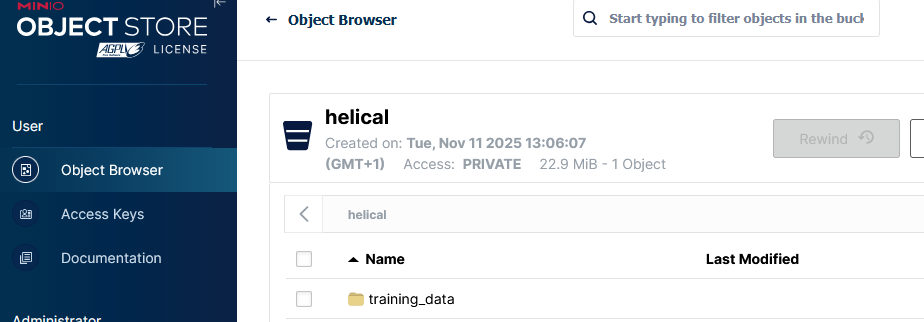

You can then see the sample data in this path:


**Keep in mind that the name of the file is irrelevant (i.e., `sample_dataset`), HOWEVER the path (i.e., `helical/training_data/cell_type_classification/raw_data`) and extension `.h5ad`) of the files need to be respected!**

Then run these commands to download all the necessary data. This is a fix to an issue within Helical's runtime download, which I assume will be resolved in the future.
```bash
wget -P ${HOME}/.cache/helical/models/geneformer/v1/ https://helicalpackage.s3.eu-west-2.amazonaws.com/${MODEL_TYPE}/${MODEL_VERSION}/gene_median_dictionary.pkl
wget -P ${HOME}/.cache/helical/models/geneformer/v1/ https://helicalpackage.s3.eu-west-2.amazonaws.com/${MODEL_TYPE}/${MODEL_VERSION}/token_dictionary.pkl
wget -P ${HOME}/.cache/helical/models/geneformer/v1/ https://helicalpackage.s3.eu-west-2.amazonaws.com/${MODEL_TYPE}/${MODEL_VERSION}/ensembl_mapping_dict.pkl
wget -P ${HOME}/.cache/helical/models/geneformer/v1/ https://helicalpackage.s3.eu-west-2.amazonaws.com/${MODEL_TYPE}/${MODEL_VERSION}/${MODEL_NAME}/config.json
wget -P ${HOME}/.cache/helical/models/geneformer/v1/ https://helicalpackage.s3.eu-west-2.amazonaws.com/${MODEL_TYPE}/${MODEL_VERSION}/${MODEL_NAME}/training_args.bin
```

Afterwards, run the workflow in this order:
```bash
helical_pdqueiros split_data
```
After you run this, you will see 2 new folders within Minio `minio:helical/training_data/cell_type_classification/archived_raw_data` and `minio:helical/training_data/cell_type_classification/chunked_data`. The former contains your initial raw data, which is archived in case the pipeline needs to be run again, the latter contains the chunks of the initial data, which have been split to allow for distributed processing of the data. If the user were to move the data from `archived_raw_data` to `raw_data` the dataset could be processed again.

```bash
helical_pdqueiros process_data
```
Now you can run the data processing, which will pick up a certain amount of chunks (i.e., `PROCESSING_CHUNKS_LIMIT`, 2 by default), process them and store them into `minio:helical/training_data/cell_type_classification/processed_data`. The idea of having a `PROCESSING_CHUNKS_LIMIT` variable is to allow for [distributed computing](#ray-example), i.e., each DAG instance (i.e., container) run picks up a certain number of chunks, and processes them. This allows you to later setup up a pipeline that deploys multiple containers per DAG run.
Note that each chunk is compressed after the data is processed to reduce local/cloud storage overhead.

```bash
helical_pdqueiros fine_tune
```
The final step is the model fine-tuning. I'm using `gf-6L-10M-i2048` as the default since it's one of the smaller models.
This pipeline will takes all the recently processed data in `minio:helical/training_data/cell_type_classification/processed_data` and fine tunes the `gf-6L-10M-i2048` model. This data will then be archived in `minio:helical/training_data/cell_type_classification/archived_processed_data` since I assume that it could be re-used for future runs of this pipeline. The idea here being that the downstream user adds new data, processes it, and then wants to use all of their (both new and archived) to fine-tune the initial model.

*You should see this message `'gf-6L-10M-i2048' model is in 'eval' mode, on device 'cuda' with embedding mode 'cell'.` when running this pipeline; if you are not running GPU fine-tuning this pipeline will take quite a while.*

You will also find the model logged into Mlflow, as shown below:

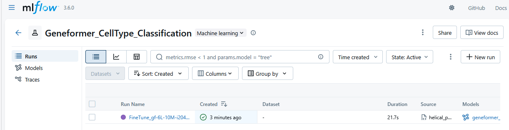
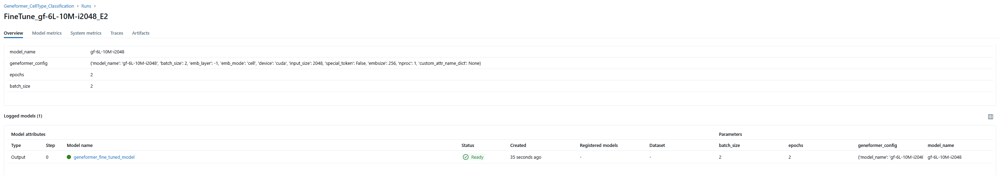

Note that I'm logging the model (for experiment purposes) but not registering it, as you would do for serving the model. You could register it with :
```bash
model_uri = f"runs:/{run.info.run_id}/pytorch-model"
mv = mlflow.register_model(model_uri, "gf-6L-10M-i2048")
```

And that's the end of the pipeline. Later on the end-user could download the model from Mlflow and use it for classifying their data.


### Airflow testing

As I previously said, since we are running our DAGs using containers, the main added-value of Airflow is the scheduling and observability of the runs.  

For your reference this is how these DAGs are setup:
```python

ENV_CONFIG = dotenv_values(ENV_FILE)
BUCKET_NAME = ENV_CONFIG['HELICAL_S3_BUCKET']
MINIO_CONNECTION = Variable.get('MINIO_CONNECTION')

def get_task(execution_type: Literal['split_data', 'process_data', 'fine_tune'], image_name: str, device_requests: list=None):
    command_to_run = f'helical_pdqueiros {execution_type}'
    # https://airflow.apache.org/docs/apache-airflow-providers-docker/stable/_api/airflow/providers/docker/operators/docker/index.html
    container_id = uuid6.uuid7().hex
    return DockerOperator(
            task_id=f"run_helical_pdqueiros.{execution_type}",
            container_name=f'helical-pdqueiros.{execution_type}.{container_id}',
            image=image_name,
            mounts=[
                # I've set the SLEEP_TIME between internal steps to 5 so you can see the data flowing through the mount. But technically you don't need this at all
                # https://docker-py.readthedocs.io/en/stable/api.html?highlight=mount#docker.types.Mount
                Mount(source=LOCAL_DATA_PATH, target=CONTAINER_DATA_PATH, type='bind', read_only=False)
                    ],
            command=command_to_run,
            private_environment  = dotenv_values(ENV_FILE),
            api_version='1.51',
            # api_version='auto',
            network_mode="helical-network",
            auto_remove='force',
            # for docker in docker (tecnativa/docker-socket-proxy:v0.4.1) -> https://github.com/benjcabalona1029/DockerOperator-Airflow-Container/tree/master
            mount_tmp_dir=False,
            docker_url="tcp://airflow-docker-socket:2375",
            device_requests=device_requests,
        )

with DAG(
    dag_id=f'{EXPERIMENT_NAME}.split_data',
    start_date=pendulum.datetime(2025, 1, 1),
    schedule='* * * * *',
    catchup=False,
    tags=["helical-pdqueiros", 'split_data'],
    ) as dag:
        sensor_key_with_regex = S3KeySensor(task_id="sensor_key_with_regex.split_data",
                                            # this is the connection ID we setup in the UI
                                            aws_conn_id=MINIO_CONNECTION,
                                            bucket_name=BUCKET_NAME,
                                            bucket_key=ENV_CONFIG['SENSOR__RAW_DATA_PATTERN'],
                                            timeout=10,
                                            use_regex=True)
        split_data_task = get_task(execution_type='split_data', image_name=IMAGE_NAME)
        sensor_key_with_regex >> split_data_task

with DAG(
    dag_id=f'{EXPERIMENT_NAME}.process_data',
    start_date=pendulum.datetime(2025, 1, 1),
    schedule='* * * * *',
    catchup=False,
    tags=["helical-pdqueiros", 'process_data'],
    ) as dag:
        sensor_key_with_regex = S3KeySensor(task_id="sensor_key_with_regex.process_data",
                                            aws_conn_id=MINIO_CONNECTION,
                                            bucket_name=BUCKET_NAME,
                                            bucket_key=ENV_CONFIG['SENSOR__CHUNKED_DATA_PATTERN'],
                                            timeout=10,
                                            use_regex=True)
        process_data_task = get_task(execution_type='process_data', image_name=IMAGE_NAME)
        sensor_key_with_regex >> process_data_task


with DAG(
    dag_id=f'{EXPERIMENT_NAME}.model_fine_tuning',
    start_date=pendulum.datetime(2025, 1, 1),
    schedule=None,
    catchup=False,
    tags=["helical-pdqueiros", 'fine_tuning'],
    ) as dag:
        fine_tune_task = get_task(execution_type='fine_tune',
                                  image_name=IMAGE_NAME_GPU,
                                  device_requests=[DeviceRequest(capabilities=[['gpu']], device_ids=['0'])])


```

As you can see above, there's 3 DAGs, the first 2 (`cell_type_classification.split_data` and `cell_type_classification.process_data`) are triggered via S3 sensors.

### **Note that you need to create a connection to MinIO through the Airflow UI**

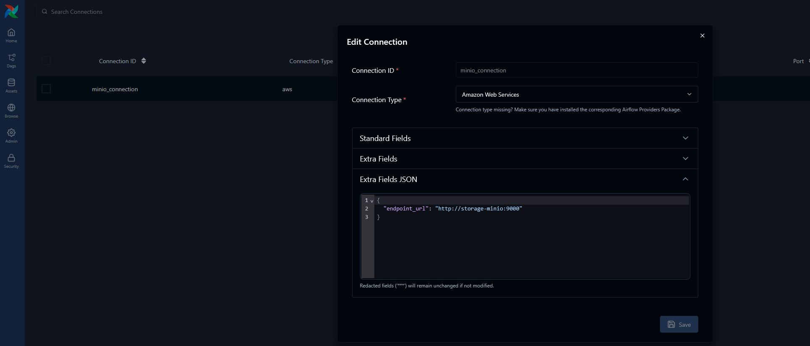

Additionally, while I've used load_dotenv to load our environmental variables (by mounting the `.env` file), in a production environment you are better off defining variables through the UI and then using `from airflow.sdk import Variable`. You can see the `MINIO_CONNECTION` example in the code and in the image below:

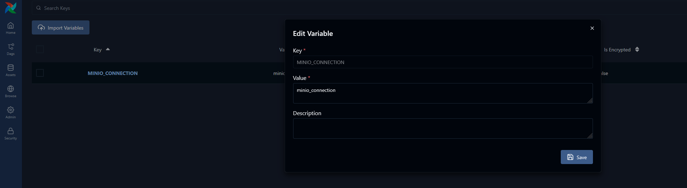
s

As you can see from the code and image below, these 2 DAGs are being trigger every minute by this sensor, which checks MinIO for regex patterns I've defined in the `.env` file:
```bash
SENSOR__RAW_DATA_PATTERN="training_data/cell_type_classification/raw_data/(.*\.h5ad)$"
SENSOR__CHUNKED_DATA_PATTERN="training_data/cell_type_classification/chunked_data/(.*\.h5ad)$"
```
If the sensor finds these patterns in MinIO, then the next task of the DAG is triggered.
The important detail here being that `cell_type_classification.process_data` can be triggered multiple times, since each internal task (`process_data_task`) only takes a certain amount of `PROCESSING_CHUNKS_LIMIT` chunks per run. So, imagine that you have a very large dataset that is split in `cell_type_classification.split_data` into very large chunks that hours to process; by triggering the `cell_type_classification.process_data` DAG multiple times, you are able to parallelize the data processing.


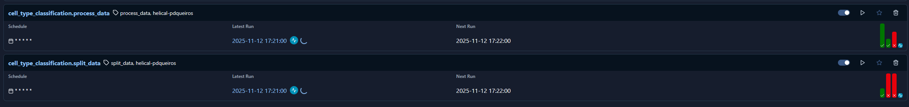

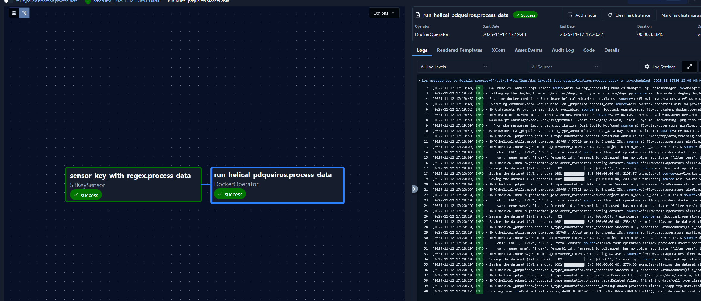


Lastly, you can manually trigger the `fine_tuning` DAG which runs the actual the model training.
Notice that since we had the `DeviceRequest` defined in our DockerOperator, the fine-tuning was done with using my local GPU (highlighted `cuda`). Similar to the local run, a model experimented is also logged into MLFlow.


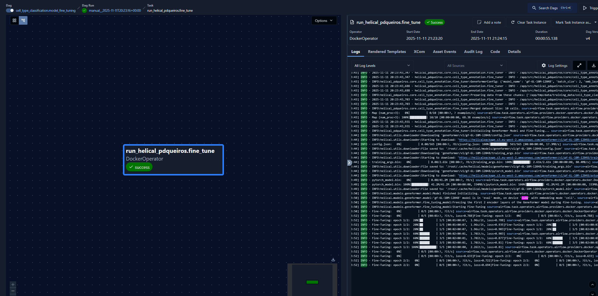

Now, as previously explained in [Detailed workflow description and local testing](#detailed-workflow-description-and-local-testing) you can start by loading sample data into [Minio](http://localhost:9001).
Then first wait for the DAGs `cell_type_classification.split_data` and `cell_type_classification.process_data` to finish and then you can run `cell_type_classification.fine_tuning`


**And this is basically the end of this showcase...**


# Troubleshooting


- If you have issues starting the docker operators due to this error:
```bash
HTTPError: 400 Client Error: Bad Request for url: http://airflow-docker-socket:2375/v1.51/containers/96fe8a3b85832292c1e456c20504c3f18e0190dcb31fefe33149ee0fee8db640/start
```
A docker or system reboot will fix the issue.

- `FileNotFoundError: [Errno 2] No such file or directory: '/home/pedroq/.cache/helical/models/geneformer/v1/gene_median_dictionary.pkl'` If you get this error, run these commands:
```bash
source env.sh
wget -P ${HOME}/.cache/helical/models/geneformer/v1/ https://helicalpackage.s3.eu-west-2.amazonaws.com/${MODEL_TYPE}/${MODEL_VERSION}/gene_median_dictionary.pkl
wget -P ${HOME}/.cache/helical/models/geneformer/v1/ https://helicalpackage.s3.eu-west-2.amazonaws.com/${MODEL_TYPE}/${MODEL_VERSION}/token_dictionary.pkl
wget -P ${HOME}/.cache/helical/models/geneformer/v1/ https://helicalpackage.s3.eu-west-2.amazonaws.com/${MODEL_TYPE}/${MODEL_VERSION}/ensembl_mapping_dict.pkl
wget -P ${HOME}/.cache/helical/models/geneformer/v1/ https://helicalpackage.s3.eu-west-2.amazonaws.com/${MODEL_TYPE}/${MODEL_VERSION}/${MODEL_NAME}/config.json
wget -P ${HOME}/.cache/helical/models/geneformer/v1/ https://helicalpackage.s3.eu-west-2.amazonaws.com/${MODEL_TYPE}/${MODEL_VERSION}/${MODEL_NAME}/training_args.bin
```

- Airflow's docker operator not recognizing GPU:
```bash
APIError: 500 Server Error for http://airflow-docker-socket:2375/v1.51/containers/c1081585ee0a0df187228d4f700dee1de67228325f97b3e2875cdc1c2497a505/start: Internal Server Error ("could not select device driver "" with capabilities: [[gpu]]")
```

If you get this error, it basically means your docker engine is not correctly passing through your machine's GPU (if you are running WSL). What I've found that worked was to shutdown wsl and Docker Desktop. Once that is done, you can first start Docker Desktop which will in turn initialize the docker engine within WSL. Make sure you also enable WSL integration in Docker Desktop:

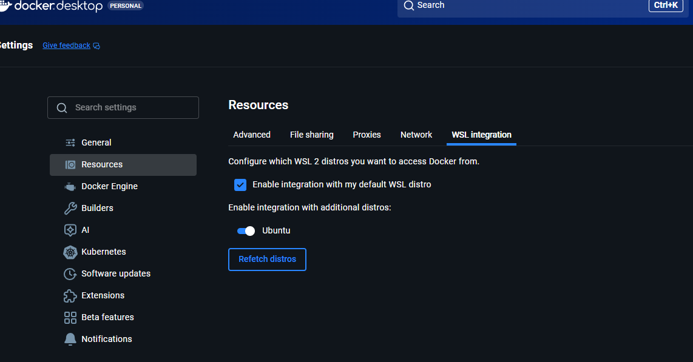

After this is done start all the containers and retry running your DAG. It should work now, if it doesn't it's likely still a docker engine and GPU passthrough issue.


# Future TODO

## Repo TODO

- add GPU profiling
- add Ray-gpu training
- I couldn't expose scrape the `ti_success` and `ti_failure` metrics from Prometheus although I do have other `otel_airflow_*` metrics being correctly exposed. I'm not sure if it's a bug from my end or Airflow's
- improve metrics dashboard and add metrics storage (maybe redis) and push to pushgateway (already deployed). You could do more interesting metrics besides counting DAGs, e.g., track model metrics over time, track amount of files/data points processed, check longitudinal data distribution, etc. The main problem here is that DAGs are ephemeral and so you'd need a way to archive the metrics. I've used Redis in the past for this and it's a rather easy solution. For example: service publishes to permanent collector using Redis for messaging; collector collects current metrics from Redis and updates values, and pushes to prometheus using pushgateway.
- improve model scaling (there's a lot of new tools that could be useful for acceleration). I'd need to do some more research on that end.
- I've setup everything to be in the same docker network, but it could be better separated 
- I didn't follow any security measures, since this was done for prototyping, obviously don't use this repo in a production environment
- I'd split the processes into multiple images, the data splitting and processing could be done via a very light image with minimal requirements.
- Find a way to retrieve data/xcom through the DockerOperators, which at the moment is not possible the containers are terminated automatically (as intended). In any case, using something like Redis would like be preferrable (and easy). 
- Find a way to deal with orphan containers generated via docker operator. If you stop your DAG midway, this will happen:
```bash
APIError: 409 Client Error for http://airflow-docker-socket:2375/v1.51/containers/create?name=helical-pdqueiros.fine_tune: Conflict ("Conflict. The container name "/helical-pdqueiros.fine_tune" is already in use by container "1b410b96c8adeeba7241c252bfdf7cff1b038cce6535a8d736d6b4293566d91c". You have to remove (or rename) that container to be able to reuse that name.")
```
- I had some issues downloading the necessary data from AWS (e.g., `gene_median_dictionary.pkl`). I'm not sure why, when I `exec` into the container, I can download them via wget and through helical. But through the DockerOperator, Helical's download method always fails. To avoid that, I baked these files into the image, which  anyway is a better practice to make sure the image is truly static and requires no external data (remember what happened during the AWS outage?).


## Helical TODO

- fix logging (it's consuming too much and leading to weird behaviour)
- clean up code in models
- add accelerator to some of the models
- migrate to hugging face trainer; not sure how feasible it is since some models have some specific internal behaviour
- Add UV installation and dependencies grouping (both very easy wins). The base pyproject is way too large, e.g.:
    - dependency group for data processing
    - dependency group per model -> I imagine you also run into compability issues quite often
- Improve file path management
- There's some weird behaviour in the data downloading, both locally and within containers. This seems to work when you download the data using `wget` but I think the runtime downloading function is not working properly.
```bash
Traceback (most recent call last):
  File "/home/pedroq/envs/helical_pdqueiros/lib/python3.11/site-packages/decorator.py", line 235, in fun
    return caller(func, *(extras + args), **kw)
           ^^^^^^^^^^^^^^^^^^^^^^^^^^^^^^^^^^^^
  File "/home/pedroq/envs/helical_pdqueiros/lib/python3.11/site-packages/retry/api.py", line 73, in retry_decorator
    return __retry_internal(partial(f, *args, **kwargs), exceptions, tries, delay, max_delay, backoff, jitter,
           ^^^^^^^^^^^^^^^^^^^^^^^^^^^^^^^^^^^^^^^^^^^^^^^^^^^^^^^^^^^^^^^^^^^^^^^^^^^^^^^^^^^^^^^^^^^^^^^^^^^
  File "/home/pedroq/envs/helical_pdqueiros/lib/python3.11/site-packages/retry/api.py", line 33, in __retry_internal
    return f()
           ^^^
  File "/home/pedroq/personal/helical_pdqueiros/src/helical_pdqueiros/core/cell_type_annotation/data_processer.py", line 30, in __init__
    self.tokenizer = TranscriptomeTokenizer(
                     ^^^^^^^^^^^^^^^^^^^^^^^
  File "/home/pedroq/envs/helical_pdqueiros/lib/python3.11/site-packages/helical/models/geneformer/geneformer_tokenizer.py", line 256, in __init__
    with open(gene_median_file, "rb") as f:
         ^^^^^^^^^^^^^^^^^^^^^^^^^^^^
FileNotFoundError: [Errno 2] No such file or directory: '/home/pedroq/.cache/helical/models/geneformer/v1/gene_median_dictionary.pkl'
```


# Other info

- [Setting up docker.sock for Airflow DockerOperators](https://github.com/benjcabalona1029/DockerOperator-Airflow-Container/blob/master/docker-compose.yaml)
- [Airflow config](https://airflow.apache.org/docs/apache-airflow/stable/configurations-ref.html#config-metrics)
- [Airflow metrics](https://airflow.apache.org/docs/apache-airflow/stable/administration-and-deployment/logging-monitoring/metrics.html)


### ray-example

This section includes some legacy information that I didn't include in the final codebase so I'll store it here for posterity.

I've tried deploying Ray with Terraform with `kuberay.tf` and `helical_pdqueiros/config/raycluster.yaml`. To deploy Ray with terraform run this:
```bash
terraform apply -target=helm_release.kuberay_operator
```

I managed to connect to the Ray cluster from a local execution but got stuck pushing the necessary image to the Docker Desktop Kubernetes registry. I'm not sure why, but the pod cannot pull the image from the Docker Desktop registry. The `helical-pdqueiros-ray-cpu` image is also quite large so I can't load it multiple times (for testing) into ECR without blowing up my monthly quota.
On the other hand, I've managed to do so with minikube by building the image into Minikube's internal docker registry by running:
```bash
eval $(minikube -p minikube docker-env)
docker compose -f docker-compose-build.yaml build helical-pdqueiros-ray-cpu
# Check that the images are available with:
minikube image ls
```

However, GPU access through Minikube was not easy to setup, so for now I've decided to stick with Docker Desktop as it seems to work best out-of-the-box and covers the task description.

If you want to try Ray locally, this is the code I've used:

```python
import ray
RAY_ENDPOINT = os.getenv('RAY_ENDPOINT', 'ray://localhost:10001')
@ray.remote
def ray_process_data(file_name: str):
    # all non-pickable objects are created here, and so we should avoid having very small chunks, otherwise we get more overhead
    local_file_path = os.path.join(LOCAL_CHUNKED_DATA_PATH, file_name)
    output_path = os.path.join(LOCAL_PROCESSED_DATA_PATH, f'{Path(file_name).stem}.dataset')
    logger.debug(f'Processing data in {local_file_path}')
    s3_client = ClientS3()
    data_processor = CellTypeAnnotationDataProcessor()
    try:
        data_document = DataDocument(file_path=local_file_path)
        output_path = data_processor.process_data(data_document=data_document, output_path=output_path)
        compressed_output_path = ProcessData.compress_file(file_path=output_path)
        return compressed_output_path
    except Exception as e:
        s3_file_path = os.path.join(CHUNKED_DATA_PATH, file_name)
        s3_error_file_path = os.path.join(CHUNKED_DATA_ERROR_PATH, file_name)
        logger.error(f'Failed to process {local_file_path}, moving from {s3_file_path} to {s3_error_file_path} skipping due to {e}')
        s3_client.move_file(current_path=s3_file_path, new_path=s3_error_file_path)
        s3_client.unlock_file(locked_s3_path=s3_error_file_path)
    os.remove(local_file_path)

    def process_data_with_ray(self) -> list[str]:
        ray.init(RAY_ENDPOINT,
                     runtime_env={
                        "py_executable": "/app/.venv/bin/python",
                        "env_vars": {
                            "PATH": "/app/.venv/bin:$PATH",
                            "PYTHONPATH": "/app/src:$PYTHONPATH",
                        },
                    },
                )
        res = []
        to_process = []
        for file_name in os.listdir(LOCAL_CHUNKED_DATA_PATH):
            to_process.append(ray_process_data.remote(file_name=file_name))
        res = ray.get(to_process)
        os.remove(local_file_path)
        return res

    def process_data(self, distributed: bool=False) -> list[str]:
        if distributed:
            logger.debug('Processsing data with Ray')
            return self.process_data_with_ray()
        else:
            logger.debug('Processsing data iteratively')
            return self.process_data_with_base_python()
```

You have to also tunnel into the head service so that the ray endpoint (localhost:10001) becomes available:
```bash

kubectl port-forward service/helical-raycluster-head-svc -n helical-pdqueiros 8265:8265 10001:10001
```


Terraform apply Kuberay issues:
```
╷
│ Error: API did not recognize GroupVersionKind from manifest (CRD may not be installed)
│ 
│   with kubernetes_manifest.raycluster,
│   on kuberay.tf line 51, in resource "kubernetes_manifest" "raycluster":
│   51: resource "kubernetes_manifest" "raycluster" {
│ 
│ no matches for kind "RayCluster" in group "ray.io"
╵
```

When this happens you can:
```bash
# run this first to first install the kuberay CRD 
terraform apply -target=helm_release.kuberay_operator
# deploy the rest
terraform apply
```